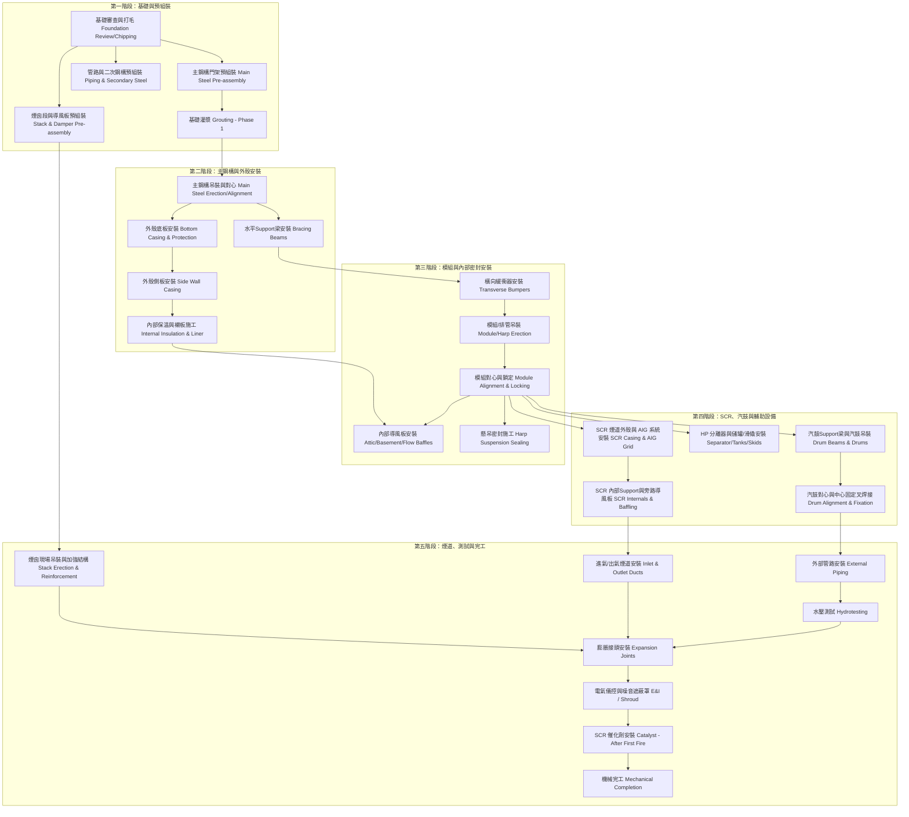

這份文件包含精確的施工流程圖以及基於技術手冊整理的完整施工順序表，旨在確保安裝過程符合 ASME 規範與製造商技術要求。

1\. 施工流程圖 (Full Erection Flowchart)
-----------------------------------

---

2\. 詳細施工步驟順序表
-------------

### 第一階段：基礎與預組裝

| 施工步驟                         | 準備工作與前提條件 (Preparations and preconditions)             | 釋出後續活動 (Release subsequent activities)     |
| ---------------------------- | ------------------------------------------------------ | ------------------------------------------ |
| **基礎審查 (Foundation Review)** | 提供第三方調查報告；核實地栓座標、標高與預留孔清潔度；完成接地工程。                     | **釋出主鋼構安裝**：確保基礎接觸區已完成打毛 (Chipping) 施工。    |
| **主鋼構門架預組裝**                 | 準備水平墊木（若在基礎上組裝需保護）；清點材料熱號(material heat no’s)與 OSD 報告。 | **釋出預組裝門架吊裝**：在水平狀態完成橫向緩衝Support安裝並通過最終檢查。 |
| **煙囪段預組裝 (Stack Sections)**  | 準備水平平台；在殼板標記 0/120/240 度參考點；搭建內外腳手架。                   | **釋出煙囪現場零件、平台、儀器接頭與外部保溫施工**。               |
| **煙囪導風板預組裝 (Damper)**        | 準備水平平台並校平；移除供應商彩色標記的固定裝置。                              | **釋出導風板縱向焊道焊接**。                           |
| **基礎灌漿 (Grouting)**          | 主鋼構、二次鋼構或設備底座已就位；模板與混凝土面清潔完成。                          | **釋出後續荷重安裝活動**：需視養護時間（通常約 5 天）。            |

### 第二階段：主鋼構與外殼安裝

| 施工步驟 | 準備工作與前提條件 (Preparations and preconditions) | 釋出後續活動 (Release subsequent activities) |
| --- | --- | --- |
| **主鋼構吊裝 (Main Steel)** | 基礎釋出；墊片 (Shim stacks) 已校平且不突出；吊裝前完成緩衝Support預裝。 | **釋出水平Support梁與汽鼓Support梁安裝**。 |
| **主鋼構水平Support梁** | 門架吊裝完成；測量立柱間距以確定補償墊片厚度。 | **釋出散裝外殼板安裝**。 |
| **外殼底板安裝 (Bottom Casing)** | 主鋼構對心完成；準備腳手架與保護襯板用的膠合板 (Plywood)。 | **釋出底板保溫/襯板、角鐵連接與側板安裝**。 |
| **外殼側板安裝 (Side Wall)** | 主鋼構對心完成；材料清點與 OSD 調查。 | **釋出保溫/襯板 field splices 與角鐵連接施工**。 |
| **內部保溫與襯板施工** | 外殼面板焊接完成並清淨；保溫銷已焊接定位。 | **釋出內部導風板與密封板安裝**。 |

#### 8.1 主鋼構 (Main steel structure)

-   **安裝順序：** 墊片設定 → 門架吊裝 (附帶橫向緩衝Support) → Support梁 (Bracing) 與汽鼓Support梁安裝 → 接地連接。
-   **安裝細節：** 頂梁無吊耳，需使用**吊帶 (Slings)**；對心應從門架內部執行，垂直度需符合公差圖。
-   **注意事項/要求：** 禁止用火切擴孔；對心時需放鬆臨時纜繩 (Guy wires)。

#### 8.3 外殼安裝 (Casing - Bottom, Side and Top)

-   **安裝順序：** 底板 (由前至後) → 角鐵連接 → 側板 → 模組吊裝後安裝剩餘垂直面板 → 頂板。
-   **安裝細節：** 外部為**全連續焊**，內部可為間斷焊；利用膠合板 (Plywood) 保護底板襯板直至完工。
-   **注意事項/要求：** 焊接時需用焊接毯保護保溫棉；所有角落需用填充板密封焊以確保氣密。

### 第三階段：模組與核心組件安裝

| 施工步驟                           | 準備工作與前提條件 (Preparations and preconditions) | 釋出後續活動 (Release subsequent activities)     |
| ------------------------------ | ------------------------------------------ | ------------------------------------------ |
| **橫向緩衝器 (Transverse Bumpers)** | 核實緩衝器編號與材料組標記；Support標高與水平度正確。             | **釋出模組吊裝**：需維持自由間隙「A」。                     |
| **模組吊裝 (Module Erection)**     | 主鋼構灌漿完成；強背架 (Strong back) 預組裝；移除彈簧處臨時墊塊。   | **釋出模組對心**：確認 Piece marks 正確並入位。           |
| **模組對心 (Module Alignment)**    | 該箱體內所有模組吊裝完成；確認底部集管水平。                     | **釋出集管連接板、懸吊密封與繞接連接 (Wrap around)**。       |
| **肩膀結構 (Internal Shoulders)**  | 側壁外殼保溫襯板施工完成；核實材料清點。                       | **釋出模組鎖定 (Locking of bundles)**：確保間隙「a」正確。 |
| **模組鎖定 (Locking)**             | 內部肩膀結構與繞接固定安裝完成。                           | **釋出內部管路安裝**：安裝臨時型鋼鎖定模組。                   |
| **流量導風板 (Flow Baffle)**        | 進氣煙道外殼與熱箱管路施工完成。                           | **釋出密封角鐵與連接板施工**：確保不焊在管狀緩衝器上。              |
| **懸吊密封 (Harp Sealing)**        | 模組對心與鎖定完成。                                 | **釋出頂部密封盒氣密焊接**。                           |

#### 8.5 橫向緩衝器 (Transverse bumpers)

-   **安裝細節：** 依據編號與材料組標記安裝於各排鋼構上。
-   **注意事項/要求：** 緩衝器與Support間需維持**自由間隙 (Gap A)**；導向板僅能焊在緩衝器上，禁止焊在Support架上。

#### 8.7 模組安裝 (Module erection)

-   **安裝順序：** 接收 → 裝載至強背架 (Strong back) → 轉立直放 → 吊入鍋爐 → 連接懸吊梁 → 對心。
-   **安裝細節：** 對心透過調整懸吊桿頂部的螺母完成；需確認底部集管標高正確。
-   **注意事項/要求：** 模組鎖定 (Locking of bundles) 需在內部管路施工前完成，以維持標高。

#### 8.9 導風板與密封板 (Baffles and sealing plates)

-   **安裝順序：** 緩衝密封板 → 頂棚(Attic)與地下室(basement)導風板 → 側壁氣擋。
-   **注意事項/要求：** 考量熱膨脹，滑動連接點的螺 Bolt 應**手指緊固並點焊**；導風板與襯板間應留有正確間隙。

### 第四階段：SCR、汽鼓與輔助設備

| 施工步驟 | 準備工作與前提條件 (Preparations and preconditions) | 釋出後續活動 (Release subsequent activities) |
| --- | --- | --- |
| **SCR 煙道外殼施工** | 下游模組鎖定；準備 SCR 區段底板與側板吊裝。 | **釋出 SCR 內部保溫與 AIG/SCR 系統安裝**。 |
| **AIG 系統安裝** | 內部襯板完成；測量穿透孔與Support架座標。 | **釋出 AIG 外部管路連接**。 |
| **SCR 內部結構施工** | 安裝催化劑Support架、導流板與旁路流體導風板。 | **釋出 SCR 頂面板安裝**。 |
| **汽鼓吊裝與Support** | 模組安裝完成；汽鼓Support梁與 PTFE 滑動墊片安裝到位。 | **釋出汽鼓對心**。 |
| **汽鼓對心與固定** | 汽鼓就位；利用上升管 (Risers) 試裝確定偏移量並確保無應力。 | **釋出中心固定叉與導板焊接**。 |
| **HP 分離器與儲罐安裝** | 支持結構與基礎就緒；清點件號與熱號。 | **釋出灌漿與管路連接**：需移除內部乾燥劑包。 |

### 第 9 章：SCR 系統 (SCR SYSTEMS)

-   **安裝順序：** SCR 煙道底板/側板 → 內部保溫 → AIG/SCR Support架 → AIG 噴氨管 → 頂板。
-   **注意事項/要求：** 催化劑模塊 (Catalyst blocks) 通常在**初火 (First fire) 之後**才安裝。

### 第 10 章：汽鼓與壓力容器 (DRUMS AND VESSELS)

-   **安裝順序：** 滑動支座安裝 → 汽鼓吊裝至正確標高 → 利用上升管對心 → 中心固定叉焊接。
-   **安裝細節：** 檢查 PTFE 墊片無損壞且表面清潔。
-   **注意事項/要求：** 汽鼓內部 demister 在水壓測試前應移除並檢查內部清潔。

### 第五階段：煙道、測試與完工

| 施工步驟                        | 準備工作與前提條件 (Preparations and preconditions) | 釋出後續活動 (Release subsequent activities) |
| --------------------------- | ------------------------------------------ | -------------------------------------- |
| **進氣與出氣煙道 (Ducts)**         | 基礎與鋼構準備就緒；消音器 (Silencers) 支持系統完工。          | **釋出調節法蘭、消音器模塊及外部保溫施工**。               |
| **煙囪現場吊裝 (Stack)**          | 基座環標高與 0/90/180/270 度參考點校正完成。              | **釋出加強結構、排水系統與導風板運轉測試**。               |
| **管路施工 (Piping)**           | 模組與汽鼓定位完成；依 LISL 準備管件與 NDE 程序。             | **釋出水壓測試**。                            |
| **水壓測試 (Hydrotesting)**     | 測試包 (含 NDE 報告與 As-built) 核准；所有管路支吊架到位。     | **釋出外部保溫與水壓堵頭 (Plugs) 移除**。            |
| **膨脹接頭 (Expansion Joints)** | 法蘭面平滑；**填充充足保溫棉以防熱點**。                     | **釋出焊毯保護直到施工結束**。                      |
| **電氣儀控與噪音遮蔽罩**              | 支架與橋架施工完工；設備清點。                            | **釋出試運轉 (Commissioning)**。             |
| **機械完工 (Completion)**       | 所有 FQP 簽署完成；最終巡檢 (Walk-down) 執行並分類缺失。      | **正式移交營運單位**。                          |

### 第 11-14 章：輔助設備與結構

-   **儲罐與滑撬 (Tanks/Skids)：** 依據座標定位，調整標高後焊接墊片，內部需清除 Silica Gel 乾燥劑包。
-   **煙囪 (Stack)：** 基座環先置於基礎墊片，逐段吊裝並用纜繩固定；標記 0/90/180/270 度參考點；導風板 (Damper) 安裝後需手動測試活動度。
-   **進氣煙道 (Inlet Duct)：** 從鍋爐端向燃氣輪機端安裝；使用**可調法蘭 (Adjustable flange)** 補償誤差。

### 第 15 章：配管 (PIPING)

-   **安裝順序：** 大管由系統固定點開始安裝；小管隨後施工。
-   **注意事項/要求：** **Grade 91** 鋼材需嚴格遵守焊接與熱處理程序；Socket 焊接需留 **2mm 間隙**；閥門安裝時需注意開關位置要求。

### 第 16 章：膨脹接頭 (EXPANSION JOINTS)

-   **注意事項/要求：** 強烈建議由**原廠專家監督**；檢查法蘭面無尖銳邊緣；務必填充**足夠保溫棉**以防運轉後產生熱點 (Hot spots)。

### 第 17 章：水壓測試 (HYDROTESTING)

-   **準備工作：** 準備測試包 (Test package)；目視檢查焊道。
-   **注意事項/要求：** 測試完成後，必須由閥門專家移除所有安全閥上的**水壓堵頭 (Plugs)**。
