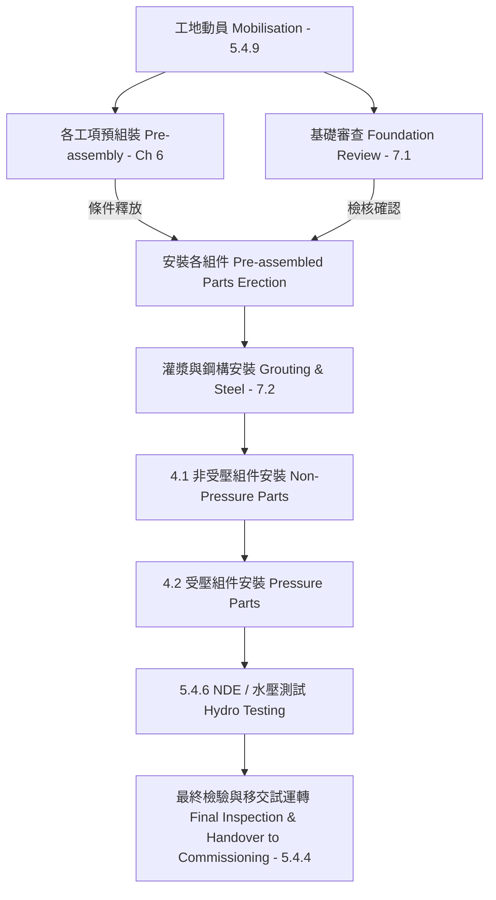

# HRSG_工序與工法規劃 (HRSG Sequence and Methodology)

## 1. 施工邏輯流程圖 (Sequence Flowchart)



## 2. 工程施工工法細節 (Construction Methodology)

### 4. HRSG 部件安裝重點 (HRSG Components Installation - Ch 4)
- **非受壓組件 (NPP):** 包含煙道、爐殼、內護板、保溫、支撐等 (章節 4.1)。
- **受壓組件 (PP):** 包含鼓筒、管束、管路與組件 (章節 4.2)。

### 5. 專案需求與施工管理 (Requirements & Management - Ch 5)
- **環境安全 (HSE):** 安裝承包商必須提交並執行 HSE 計畫與 WMS (章節 5.4.1)。
- **銲接與品質 (Welding & Quality):** 必須建立 WPS/PQR，銲工需具備資格，並執行 FQP (章節 5.4.2, 5.4.5)。
- **前置作業:** 包含現場動員、HRSG 存放規劃 (Lay-down plan)、文件核准 (章節 5.4.9)。

### 6. 鍋爐與模組安裝工序 (Boiler and Module Erection Sequence - Ch 8)
 
 ```mermaid
 graph TD
     S8_1[8.1 主鋼結構安裝與對正 Main Steel Erection] --> S8_2[8.2 主鋼結構施工架 Scaffolding]
     S8_2 --> S8_3_3[8.3.3 底部外殼板安裝 Bottom Panels]
     S8_3_3 --> S8_3_4[8.3.4 側面壁板安裝 Side Wall Panels]
     S8_3_4 --> S8_3_5[8.3.5 頂部外殼板吊裝 Top Casing with Harps]
     S8_3_5 --> S8_3_6[8.3.6 門型架列填隙板安裝 Filler Plates]
     S8_3_6 --> S8_3_7[8.3.7 角鋼/扁鋼/T型鋼連接 Angle/T-bar Connections]
     S8_3_7 --> S8_3_8[8.3.8 拼接處內部保溫及與內護板 Casing Insulation/Liner]
     S8_1 --> S8_4_2[8.4.2 頂部平台安裝 partly Top Platforms]
     S8_1 --> S8_4_3[8.4.3 樓梯安裝 Boiler Staircase]
     S8_3_8 --> S8_5[8.5 橫向緩衝器 bumper橫樑安裝 Transverse Bumpers]
     S8_4_2 --> S8_5
     S8_5 --> S8_6[8.6 門型架鋼架等之灌漿完工 Grouting Goalposts]
     S8_6 --> S8_7[8.7 模組與管排吊裝 Module/Harps Erection]
     S8_7 --> S8_8[8.8 剩餘垂直進出口頂底部外殼板安裝 Remaining Casing Panels]
     S8_8 --> S8_9_3[8.9.3 橫向/管式緩衝器 bumper密封板/端板 Bumper Sealing Plates/End Plates]
     S8_9_3 --> S8_9_4[8.9.4 頂棚與底包擋風箱導流板 Attic & Basement Baffles]
     S8_9_4 --> S8_9_5[8.9.5 模組側壁煙氣導流板 Module Sidewall Gas Baffles]
     S8_9_5 --> S8_9_6[8.9.6 流量導流板 Flow Baffle]
     S8_9_6 --> S8_9_7[8.9.7 導流板與密封板最終檢查 Final Inspection]
 ```
 
 - **外殼組裝與密封重要步驟:**
     - **填隙板安裝 (8.3.6):** 用於密封各門型架底部側面空隙，在進行角鋼連接前必須完成。
     - **角鋼 / 扁鋼與 T 型鋼連接 (8.3.7):** 於外殼板拼接及轉角處施作，外部及內部銲縫均需為**連續氣密銲**。
     - **內部保溫與內護板 (8.3.8):** 於外殼銲接及拼接完成後實施，遵循章節 7.3 之高品質保溫施工規範。
 - **次要鋼構與平台 (8.4):** 頂部平台與樓梯預組裝件應依 WMS 施工步驟高空吊裝定位。
 - **橫向緩衝器 bumper與承載 (8.5 & 8.6):** 橫向緩衝器 bumper需在灌漿與模組吊裝前完成安裝，確保整體鋼結構穩固。門型架鋼結構於模組吊裝前必須完成最終定位與無收縮灌漿。
 - **模組吊裝與剩餘爐殼安裝 (8.7 & 8.8):** 
     - **管束模組吊裝 (8.7):** 包含管排防護拆卸、臨時運輸框架固定鎖合，依吊裝程序書將管束精確沉入定位。
     - **剩餘垂直頂底部爐殼板 (8.8):** 於模組定位與臨時運輸梁解鎖後，進行進出口側與 SCR 區剩餘爐殼板角鋼對位銲接、補強板安装。
 - **保溫密封與各型導流板 (8.9):**
     - **緩衝器 bumper密封板 (8.9.3):** 連接處作為膨脹滑動點，需手緊螺栓點銲並控制熱移動自由間隙。
     - **頂棚與底包導流板 (8.9.4):** 垂直隔絕煙氣繞流，現場管道穿透密封板必須預置正確熱態位移量。
     - **模組側壁煙氣導流板 (8.9.5):** 
         - *Type 1:* 與側壁內護板貼合，蓋板作為膨脹滑動介面。
         - *Type 2:* 由 U 型鋼、補強型鋼與蓋板滑動連接，整高高度自由間隙需一致。
         - *Type 3:* 模組貼付預組「門」套合，側壁與固定角鋼双重鎖定，塞銲與段銲嚴控熱變形。
     - **流量導流板 (8.9.6):** 隔絕進口 E 軸熱箱 bypass 氣流，滑動點在管式緩衝器 bumper上嚴禁銲接！

### 7. SCR 系統安裝工序與工法 (SCR Systems Erection Sequence & Methodology - Ch 9)

 ```mermaid
 graph TD
     S9_1_3[9.1.3 SCR 爐殼安裝前置準備 Scaffolding & Plywood] --> S9_1_4[9.1.4 底部爐殼板吊裝對正與焊接 Bottom Casing Erection]
     S9_1_4 --> S9_1_5[9.1.5 側壁爐殼板吊裝與對正 Side Wall Casing Erection]
     S9_1_5 --> S9_1_6[9.1.6 底部與側壁內部保溫及內護板 Internal Insulation]
     S9_1_6 --> S9_2_4[9.2.4 AIG 系統內部支撐與噴嘴管安裝 AIG Erection]
     S9_1_6 --> S9_2_5[9.2.5 SCR 內部支撐、框架與導流板安裝 SCR Frame Erection]
     S9_2_4 --> S9_3_4[9.3.4 頂部爐殼板安裝與焊接 Top Casing Erection]
     S9_2_5 --> S9_3_4
     S9_3_4 --> S9_3_5[9.3.5 頂部爐殼內部現場保溫與內護板 Top Insulation & Liner]
     S9_3_5 --> S9_3_6[9.3.6 AIG 與 SCR 系統機械完工步行巡檢 MC & Walk-down]
     S9_3_6 --> S9_3_7[9.3.7 運轉滿載 24 小時後安裝觸媒積木塊 SCR Catalyst Block Installation]
 ```

 - **SCR 爐殼施工與保護 (9.1):**
     - **夾板地板保護 (9.1.3):** 於預組裝階段鋪設防護木夾板於底部爐殼板上，直至施工結束以徹底防止內護板損傷。
     - **底部與側壁爐殼安裝 (9.1.4 & 9.1.5):** 
         - 穿透孔保護套不可以用力拉扯，必須使用刀具整齊切割切除。
         - 對齊高程、焊接坡口，外部銲接均需為**連續氣密銲**，嚴禁外部間斷銲（跳銲）。內部銲縫依圖示進行間斷銲。
         - 點銲與銲接期間必須使用銲接護毯覆蓋保溫棉以進行火花防護。
     - **內部現場保溫及內護板 (9.1.6):** 底部與側壁爐殼板銲接與對齊完工後，始可施作內部保溫與內護板，完成後釋放 AIG 與 SCR 內部部件吊裝。
 - **AIG 與 SCR 系統吊裝 (9.2):**
     - **支撐高程測量 (9.2.4 & 9.2.5):** 吊裝前需精密測量爐殼穿透管、內部支撐座高程及正確位置。偏差需與原廠聯繫諮商。
     - **SCR 觸媒框與 AIG 框架吊裝 (9.2.4 & 9.2.5):** AIG 氨噴嘴與內部主管道裝配需依照供應商裝配手冊執行， SCR 觸媒積木塊**嚴禁在首次點火前安裝**，需於機組運轉滿載 24 小時後始可裝設。
 - **頂部爐殼與機械完工 (9.3):**
     - **頂棚外殼板吊裝 (9.3.4):** AIG 與 SCR 內部結構吊裝完成後始得施作。
     - **隨班施工作業紀錄 (9.3.4 & 9.3.6):** 工序之品質接受與釋放需完整登錄於現場安裝隨步施工紀錄表 (Travelers) 並經由業主簽認。
     - **機械完工步行巡檢 (9.3.6):** 完工後全系統步行巡檢 (Walk-down)，列出 Punch List 未決點，並依 A（水壓前）、B（試車前）、C（驗收前）進行分級。


### 8. 汽鼓與容器安裝工序與工法 (Drums & Vessels Erection Sequence & Methodology - Ch 10)

 ```mermaid
 graph TD
     S10_3[10.3 汽鼓安裝與位置測繪 Drum Erection & Survey] --> S10_4[10.4 汽鼓與上升管、聯箱對正 Drum Alignment]
     S10_4 --> S10_5[10.5 中心固定叉與導向板銲接及螺栓緊固 Center Fixation & Guides]
     S10_5 --> S10_6[10.6 汽鼓內部拆洗檢查與水位計安裝 Internals & Level Gauges]
     S10_6 --> S10_8[10.8 最終步行巡檢與未決點 Punch List A/B/C 分級]
     S10_7[10.7 高壓分離器容器與假底座安裝 HP Separator Vessel Erection] --> S10_8
 ```

 - **汽鼓安裝與調整 (10.3):**
     - **滑動對接板與調整墊片:** 吊裝前需進行尺寸精密測量，確定支撐樑大梁、中心固定叉、滑動墊片與鞍座位置，再焊妥最適厚度之調整片(Shim Plates)。
     - **杯狀滑動支承與 PTFE 墊片:** 吊裝時需經常目視檢查 PTFE (鐵氟龍) 滑動表面確保未受損，禁止在固定對接完畢前實施點銲。
 - **上升管對正 (10.4):**
     - **無應力對齊 (Stress-Free Fit-up):** 上升管與汽鼓管嘴對合需保持無應力狀態，其餘管段使用管夾以蛇形管排聯箱(Harp Header)側為對位起點與「固定點」。對位若超出公差應調整汽鼓位置而非強行銲接。
     - **金屬膨脹接頭:** 裝配上升管時，必須確保安裝金屬膨脹接頭 (Expansion Bellows) 補償膨脹熱位移。
 - **中心固定及固定叉 (10.5):**
     - **滑動/導向間隙:** 點焊及銲接前必須精確量測中心導件與導向板之間隙並符合原廠設計圖面規範。
     - **螺栓緊固扭矩:** 依原廠規格大梁緊固基準套用正確扭矩緊固（參見圖面及 60031-730-01-008），且緊固螺栓連接（螺牙咬合段）嚴禁有任何拼接。
 - **汽鼓內部與容器檢查 (10.6 & 10.7 & 10.8):**
     - **內部雜物與防潮乾燥劑移除:** 於水壓試驗前，必須派員進入汽鼓實施內部確認，限期拆除低壓汽鼓除霧器、掏出所有矽膠乾燥包，確認連結構件完整。
     - **高壓分離器容器:** 假底座 Dummy 高程與管嘴測繪完成度將釋放後續管道連接施工。
     - **最終步行巡檢 (Walk-down 10.8):** 彙整未完成事項並簽發 MC 或最終檢查合格證書，未完成清單 Punch List 分級為 A（水壓前）、B（熱試運轉前）、C（Pac 驗收前）。


### 9. 儲罐與撬塊安裝工序與工法 (Tanks & Skids Erection Sequence & Methodology - Ch 11)

 ```mermaid
  graph TD
      S11_3[11.3 儲罐與撬塊底座定位與調整 Tanks / Skids Erection] --> S11_4[11.4 基礎無收縮水泥灌漿 Grouting of Tanks / Skids]
      S11_4 --> S11_5[11.5 最終機械檢查與未決點 Punch List A/B/C 分級]
 ```

 - **儲罐與撬塊吊裝定位 (11.3):**
     - **基礎高程與座落測繪:** 吊裝前需檢核基礎中心線與標高。使用調整墊片 (Shim Plates) 微調水平。
     - **防潮包移除與防護:** 安裝前，容器內部乾燥劑、防潮袋 (Silica Gel Bags) 必須掏盡，核對內部清潔度。
 - **二次灌漿施作 (11.4):**
     - 依「無收縮水泥灌漿」標準章節施作底座空隙填充，確保設備底座受力飽滿。
 - **最終機械檢查 (11.5):**
     - 系統完工後進行步行聯合巡檢，未完成工項列入未決點清單 (Outstanding Items List) 依 A/B/C 級分類，簽發最終檢查合格證書。


### 10. 煙囪與出口煙道安裝工序與工法 (Stack & Outlet Duct Erection Sequence & Methodology - Ch 12)

 ```mermaid
  graph TD
      subgraph 煙囪安裝 Stack Erection
          S12_1_3[12.1.3 煙囪底座環對正底座法蘭 Stack Base Ring] --> S12_1_4[12.1.4 煙囪分段現場吊裝與高難度對中 Subsequent Stack Sections]
          S12_1_4 --> S12_1_5[12.1.5 煙囪補強鋼結構/斜撐安裝 Reinforcement Structure]
          S12_1_5 --> S12_1_6[12.1.6 排水防洩點/端部蓋板銲接 Bottom of Stack]
          S12_1_6 --> S12_1_7[12.1.7 煙囪擋板及防雨門安裝 Stack Damper]
          S12_1_7 --> S12_1_9[12.1.9 煙囪座基礎無收縮灌漿 Grouting Stack]
          S12_1_9 --> S12_1_10[12.1.10 煙囪分部機械完工 Final Inspection Stack]
      end
      
      subgraph 出口煙道安裝 Outlet Duct Erection
          S12_2_3[12.2.3 出口煙道底部壁板裝配 Bottom Panels] --> S12_2_5[12.2.5 兩側壁板與外部鷹架搭設 Right & Left Panels]
          S12_2_5 --> S12_2_7[12.2.7 對向側壁壁板連續氣密銲接 Opp. Sidewall Panels]
          S12_2_7 --> S12_2_8[12.2.8 內部消音器積木塊與導流板裝配 Silencers / Baffles]
          S12_2_8 --> S12_2_9[12.2.9 頂部壁板、起吊支撐與密封銲 Erection Top Panels]
          S12_2_9 --> S12_2_10[12.2.10 出口煙道機械完工聯合巡檢 Final Inspection Outlet Duct]
      end
 ```

 - **煙囪安裝關鍵 (12.1):**
     - **底座法蘭環對準 (12.1.3):** 基礎千斤頂支撐螺栓與調節墊片必須調校中心線度、高程與高平面度公差。
     - **煙囪節段吊裝 (12.1.4):** 採用大噸位吊車進行高空組對，銲接坡口拼縫、起吊夾具安全檢查完畢。外部採**連續氣密銲**。
     - **煙囪擋板防雨組裝 (12.1.7):** 擋板驅動端、防雨密封與限位元開關裝配，需與儀控電、控制迴路協調試車。
 - **出口煙道與消音器 (12.2):**
     - **底部與側壁外殼銲接 (12.2.3 & 12.2.5):** 兩側外殼吊裝對正後，角隅部 6mm 封板氣密銲。
     - **消音器板片/導流板 (12.2.8):** 消音器片 (Silencer baffles) 應高空平移滑入內部滑軌定位，注意內部保溫護板銲接火花防護。
     - **頂部外殼與最终驗收 (12.2.9 & 12.2.10):** 外殼密封銲與吊掛支撐銲妥後，實施全系統步行檢視與 Punch List 三級建檔。


### 11. 進口煙道安裝工序與工法 (Inlet Duct Erection Sequence & Methodology - Ch 13)

 ```mermaid
  graph TD
      subgraph 主鋼結構 Main Steel
          S13_1_3_1[13.1.3 基礎高程、墊 shims 測繪 Preparations] --> S13_1_3_2[13.1.3 主門型架及 PTFE 滑動板安裝 Goalposts & PTFE Sliders]
          S13_1_3_2 --> S13_1_3_3[13.1.3 鋼結構對齊與錨栓扭矩鎖緊 Anchor Torque]
      end
      
      subgraph 進口煙道外殼與管件安裝 Casing & Fitting
          S13_1_3_3 --> S13_2_3[13.2.3 底部壁板與支撐連續氣密銲接 Bottom Panels]
          S13_2_3 --> S13_2_4[13.2.4 兩側壁板對合、6mm 轉角角板封閉氣密銲 Sidewall Panels]
          S13_2_4 --> S13_2_5[13.2.5 頂部壁板、槽鐵密封與起吊支撐吊裝銲接 Top Panels]
          S13_2_5 --> S13_2_6[13.2.6 鋼結構支柱二次無收縮灌漿 Grouting Steel]
          S13_2_5 --> S13_2_7[13.2.7 端板與連接板等現場零組件組焊 Field Parts]
          S13_2_7 --> S13_2_8[13.2.8 可調式補償器法蘭與定位墊塊安裝 Adjustable Flange]
          S13_2_8 --> S13_2_9[13.2.9 內部接縫保溫補實與護面板點銲固定 Liner/Insulation]
          S13_2_9 --> S13_3[13.3 機械完工步行巡檢、NCR 結案與 FQP 會簽 Final Inspection]
      end
 ```

 - **進口煙道主鋼結構 (13.1):**
     - **PTFE 滑動表面保護 (13.1.3):** 帶有 2 mm PTFE 滑動墊的支承門架定位前，必須清除承壓板表面污物異物、確保滑動自由。
     - **錨定扭矩 (13.1.3):** 主鋼架校正對正到位，必須以正確扭矩緊固錨定螺栓。螺栓孔距偏差應向原廠呈報。
 - **煙道外殼拼接及銲接 (13.2):**
     - **從 boiler 側向 GT 側安裝 (13.2.3 - 13.2.5):** 煙道板由鍋爐向氣渦輪機方向安裝，由後端向前端釋放製造及安裝公差。
     - **外殼氣密銲接:** 外部一律進行**連續氣密銲**（嚴禁外部跳銲 / 間斷銲），轉角收口縫與現場拼接長度使用 6mm 封板補強連續銲。
     - **可調式法蘭及間心塊定位 (13.2.8):** 補償器膨脹對接口法蘭，必須使用專用間距塊（Distance Holders / 定位塊）控制伸縮縫淨寬，且在膨脹節（非受壓）裝配完成前**嚴禁拆除間距墊塊**！
 - **最終巡檢與釋放 (13.3):**
     - A/B/C 三級 Punch List 登記。會同業主、監造核對所有 FQP、NCR 閉合狀態、外殼完成簽認手續。

### 12. 次要鋼構與吊掛型鋼安裝工序與工法 (Secondary Steel & Hoisting Beams Sequence & Methodology - Ch 14)

 ```mermaid
  graph TD
      subgraph 次要鋼構準備與基本安裝 Checklist
          S14_3_1[14.3 預備工作 / 材料檢驗 MRR/OSD Check] --> S14_3_2[14.3 地面底座調整墊片 shims 板鋪設與整平]
          S14_3_2 --> S14_3_3[14.3 預組梁、柱、爬梯、扶手、格柵板鋼架吊裝]
      end
      
      subgraph 調整銲接與完工施工
          S14_3_3 --> S14_3_4[14.3 螺栓扭矩值鎖緊、防割炬割孔螺栓錯位]
          S14_3_4 --> S14_3_5[14.3 梁、法蘭板變形偏差或過短長度修正/Shims調整]
          S14_3_5 --> S14_3_6[14.3 結構正式銲接 WPS 施工與銲前組對檢查 Fit-up]
          S14_3_6 --> S14_4[14.4 支承鋼底板二次水泥灌漿 C7.2 Grouting]
          S14_4 --> S14_5[14.5 次要鋼構現場步行查驗、Punch List A/B/C 分級 MC]
      end
 ```

 - **預組裝及吊裝準備 (14.3):**
     - **底座調整墊片 (14.3):** 地表承載立柱之前，底座鋼板下方的防沉墊片 (shims) 必須事先預放並按高程調平拔高。
     - **螺栓安全檢查:** 用於平台扶手、格柵板吊裝前，必須完成全面安全緊固鎖定，防止空中件墜落落體。
 - **尺寸偏差補正處理 (14.3):**
     - **鋼樑過短時:** 限用一片符合間隙鋼垫 Shims 補償，如偏差小於 5 mm；高於 5 mm 時兩側皆要鋪墊墊片。
     - **鋼樑過長/法蘭板變形時:** 必須切除（割除）法蘭板，鋼材切割為精準長度或法蘭整平補校後，按原 WPS 程序重新對銲接頭銲回固定。
     - **嚴禁割炬挖孔:** 螺栓错位時若需修正，严禁使用氣割槍割炬對框架螺栓孔進行大開口割孔調整。
 - **二次灌漿及最終檢查 (14.4 - 14.5):**
     - 立柱底板完成對正後按第 7.2 節規範進行無收縮二次灌漿。步行巡檢完成後核發最終檢查合格證書。

### 13. 配管安裝工序與工法 (Piping Erection Sequence & Methodology - Ch 15)

 ```mermaid
  graph TD
      subgraph 大管徑配管安裝作業 Base
          S15_1[15.1/15.2 wms/wps/fqp 品質包與受壓 Gr.91/92 受熱控溫程序確認] --> S15_3_1[15.3.1 受壓材料 OSD、管排與汽鼓安裝完妥放行]
          S15_3_1 --> S15_3_2[15.3.1 套入保溫套、穿透部密封罩單件原廠預製物料]
          S15_3_2 --> S15_3_3[15.3.1 大管徑蒸汽管路以系統固定點往外放線佈線]
      end
      
      subgraph 銲接小管徑與驗收
          S15_3_3 --> S15_3_4[15.3.1 法蘭無應力對齊、螺栓扭矩程序鎖固與坡度檢核]
          S15_3_4 --> S15_3_5[15.3.1 受壓銲接、熱電偶記錄局部熱處理 PWHT / NDE檢測]
          S15_3_5 --> S15_4[15.4 小管徑 2 inch 以下現場引路、承插銲 socket 留底 2mm 伸縮縫]
          S15_4 --> S15_5[15.5 鋼製配管支撐架水泥基腳二次灌漿 C7.2 Grouting]
          S15_5 --> S15_6[15.6 管道系統步行聯合查驗 MC、Punch Points 分級、竣工異構等角圖]
      end
 ```

 - **高溫高壓耐熱鋼銲接要求 (15.1):**
     - Cr-Mo-V 鋼合金（Gr. 91 / 92 材料）為受壓核心部件，銲接程序非常严苛，必須严格執行與現場會簽技術規範「IKZ09-909-14 91級材料製造與供應說明書」銲工登錄管理。
 - **施工前提與大管徑配管 (15.3):**
     - 配件放線佈設前，管排 (Harps) 及汽鼓 (Drums) 安裝工作應全數對中整平完畢，方可釋放配管施工。
     - **保溫套管預埋:** 穿過爐殼的高壓大管在銲接前，必須先套入單件交付、無法剖分的保溫隔熱甜甜圈 (Insulation donuts) 密封套與穿透罩，防止後續無通路套入。
     - **無應力法蘭對裝:** 法蘭接縫對合必須在**無應力 (Stress-Free)** 態下對正校螺帽，法蘭螺拴上油，依照「60031-400-20 」規格完成定扭矩緊固。
 - **小管徑管路 (15.4) 及系統完工 (15.6):**
     - 2 英吋以下小口徑配管等角圖通常為示意走線，實際施作須现场比配，確保保溫與熱移動公差不干涉，手輪安裝於易操作與檢修處。
     - **套筒承插銲留間隙 (15.4.1):** 承插連接 (Socket connections) 銲接裝配前，管端插入底部必須量測並拉回保留 **2 mm 膨脹間隙**，防止高溫受熱熱膨脹開裂。
     - **竣工等角圖和 P&ID 繪製:** 單壹配管系統完工後，承包商須立刻繪製 As-built 竣工圖冊以供水壓檢驗包審核。

### 14. 膨脹接頭安裝工序與工法 (Expansion Joints Erection Sequence & Methodology - Ch 16)

 ```mermaid
  graph TD
      subgraph 16.3/16.4 進出口織物伸縮囊安裝 Erect
          S16_1[16.1/16.2 供應商原廠手冊 FQP 與無銳利邊角檢查 Prep] --> S16_3_1[16.3/16.4 專職受訓織物伸縮囊安裝團隊、供應商專業技術指導人員見證]
          S16_3_1 --> S16_3_2[16.3/16.4 鋪設加強内部隔熱保溫棉, 阻絕熱量避免外殼 hotspots 燒損]
          S16_3_2 --> S16_3_3[16.3/16.4 壁板面補強防火花/銲毯隔離遮蓋防護]
      end
      
      subgraph 16.5 穿透口膨脹伸縮囊及 MC
          S16_3_3 --> S16_5_1[16.5 頂部金屬伸縮囊與底部織物伸縮囊穿透爐殼定位安裝]
          S16_5_1 --> S16_5_2[16.5 管路爐殼穿透對中檢查、超差使用半月型鋼 plate 修正開孔]
          S16_5_2 --> S16_6[16.6 膨脹接頭步行查驗walk-down、 FQP簽認完成與不符合 NCR 結案]
      end
 ```

 - **進出口織物膨脹接頭編織施作 (16.3 - 16.4):**
     - **保溫層填塞要點:** 織物膨脹接頭處為最薄弱保溫帶，必須塞滿充足優質的保溫材料，漏裝或填塞不足在熱回收鍋爐燃燒運轉後，會發生嚴重外殼**區域型局部高溫面（熱點 / hotspots）**，導熱伸縮囊受熱燒穿冒白煙。
     - **成品專案防護:** 膨脹接頭裝好至投產前，外部面必須鋪設銲接阻燃毯或擋泥罩封覆，嚴防上方銲接火花及掉落鐵屑燒穿織物補強布。
 - **外殼管路穿透伸縮囊 (16.5):**
     - 大口徑高溫穿透管道與爐殼穿透套管同心度與高度公差，必須精準控制，避免金屬干涉發生熱應力局部剪切。
     - **開口公差與半月型板:** 凡管位偏軸超差時，可使用**半月型（半月形）調節護板**調整並補銲接爐殼鋼板。

### 15. 水壓與壓力試驗工序與工法 (Hydrotesting & Pressure Testing Sequence & Methodology - Ch 17)

 ```mermaid
  graph TD
      subgraph 水壓前測試包準備 Test Packages Prep
          S17_2[17.1/17.2 試壓分部系統、ITP/WMS與提報合格檢驗監檢人員] --> S17_3_1[17.3 水壓試驗包整理包含 ITP/WMS竣工圖、銲接/NDE、閥件等核備清冊]
          S17_3_1 --> S17_3_2[17.3 系統管路外觀目視、各分部系統機械完工簽認、 NCR 閉合核放]
      end
      
      subgraph 試壓程序與安全閥復原
          S17_3_2 --> S17_3_3[17.3 水壓/壓力測試升壓穩壓量測 Pressure Testing]
          S17_3_3 --> S17_3_4[17.3 業主共同現場見證/簽認核放會簽]
          S17_3_4 --> S17_3_5[17.3 **CRITICAL: 安全銲接閥體內水壓測試塞徹底清除隔離及裝配復位**]
          S17_3_5 --> S17_3_6[17.3 機械試壓包結案、釋放外部保溫工程施工]
      end
 ```

 - **壓力測試包 (Test Package) 要求 (17.3):**
     - 正式水壓試驗前，必須編繪對應系統水壓合格包，包冊必須包含：封面、目錄、水壓紀錄單、程序書、檢驗與試驗計畫 (ITP) 認可本、機械完工合格證、竣工等角圖（含支架）、設備配置異構圖、材料 LISL 鋼印移植、管線/閥類表、全數對應 NDE/PWHT 檢測報告。
 - **水壓及壓力試驗安全限令 (17.3):**
     - **授權檢驗員現場簽證:** 施工規範要求，由政府授權的主檢人（鍋爐公證檢查員 / 勞檢所特檢人員）必須在壓力盤泵開啟前與會審查測試包，確認現場分項管路機械完工證書 (MCC) 均已被業主核准。
     - **安全閥臨時隔離塞復原:** 水壓試驗泵會產生高於安全閥動作值的壓力。因此，水壓加壓前安全閥內部會安裝**水壓臨時塞 (Hydrotest Plugs / 水壓堵頭)**，防止試驗期高壓造成洩壓爆開受損。
     - **⚠️ 警告:** 水壓測試正式卸壓排乾後，**必須立刻、完全地，將位於銲接式全啟式安全閥體內的水壓試驗塞/臨時隔離塞全部清除！**此清理程序涉及重大爆炸、氣震敲擊安全隱憂，必須由安全閥供應商專責工程師指導復裝與拔塞作業！

### 16. 電氣與儀控安裝工法 (Electrical & Instrumentation Methodology - Ch 18)

 - **現場儀表安裝:** 鍋爐本體及輔助各分部的變送器/傳送器、致動器/驅動器、定位器、極限開關等電儀設備安裝、與其各自供應商之原廠安裝手冊、HTT 電儀手冊 (60028-607-08) 需完全一致。
 - **敷線/導管佈線:** 现场接線由現場安裝之儀表細微細管 (tubing)、匯流排控制線及電纜到現場專用接線盒 (junction boxes) 的電纜防護托架 (cable trays) 安裝施工，防護與氣密保護由承包商全權負責施銲、螺栓固定。

### 17. 隔音罩安裝工法 (Shroud Erection Methodology - Ch 19)

 - 汽鼓頂蓋、排煙通道外罩隔音罩 (shroud) 之結構高空搭設，均需依供應商專項圖面、工程立面尺寸與原裝防雨、防震與熱位移補正說明方案細緻施工。
